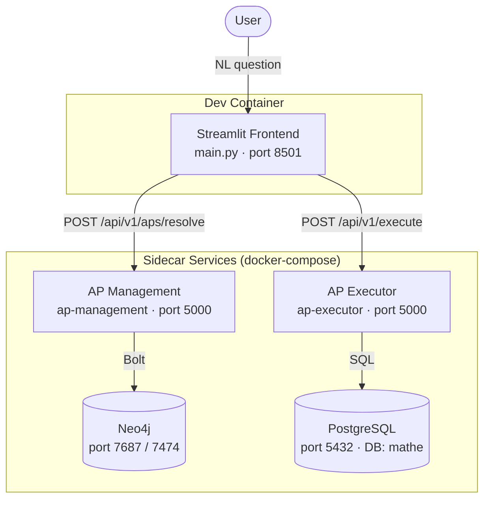

# API Generation Demo

A Streamlit app that takes a natural-language question, resolves it into an **Analytical Pattern (AP)** via the AP Management service, and executes it against a PostgreSQL database via the AP Executor service.

---

## Architecture



**Flow:**
1. The user picks a natural-language question in the Streamlit UI.
2. The frontend calls **AP Management** to resolve the question into a graph-based Analytical Pattern (stored in Neo4j).
3. The resolved AP is passed to **AP Executor**, which translates it into SQL and runs it against PostgreSQL.
4. Results are displayed in the UI.

The HTTP clients under `generated/` are auto-generated with [Kiota](https://github.com/microsoft/kiota) from the OpenAPI specs exposed by each service.

---

## Running the demo

### 1. Authenticate with GitHub Container Registry

The sidecar service images are hosted on GHCR. Create a [GitHub PAT](https://github.com/settings/tokens) with the `read:packages` scope, then log in:

```sh
echo YOUR_GITHUB_PAT | docker login ghcr.io -u YOUR_GITHUB_USERNAME --password-stdin
```

### 2. Open in the dev container

Open the repo in VS Code and choose **Reopen in Container**. This starts all sidecar services (Neo4j, PostgreSQL, AP Management, AP Executor) automatically via the `docker-compose.yml`.

### 3. Run the app

```sh
streamlit run main.py
```

The app will be available at `http://localhost:8500`.

---

## Regenerating the API clients

If a service's OpenAPI spec changes, regenerate the corresponding Kiota client:

```sh
# AP Management
kiota generate -l python -d http://ap-management:5000/openapi.json -o generated/ap_management -c ApManagementClient

# AP Executor
kiota generate -l python -d http://ap-executor:5000/openapi.json -o generated/ap_executor -c ApExecutorClient
```
